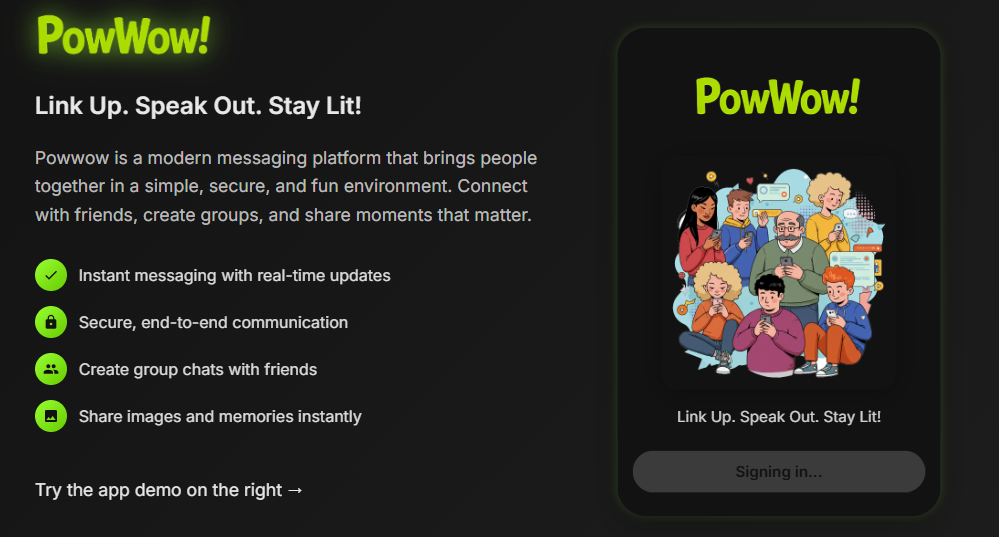

## 💡 About

PowWow! was created in just 14 hours of vibe coding during a hackathon. The name draws inspiration from the traditional Native American gathering, representing our goal of bringing people together in meaningful conversation.

# PowWow! - Link Up. Speak Out. Stay Lit!

PowWow! is a modern messaging platform built for seamless communication. Created during an intense 14-hour hackathon with nothing but good vibes and passionate coding!

## 📱 Screenshots



## ✨ Features

- Real-time messaging
- User authentication
- Profile customization
- Modern, responsive UI
- File sharing capabilities
- Search functionality

## 🛠️ Tech Stack

- React 19
- TypeScript
- Firebase (Authentication, Firestore, Storage)
- Vite
- Cloudinary for image processing

## 🚀 Getting Started

```bash
# Install dependencies
npm install

# Start development server
npm run dev

# Build for production
npm run build

# Preview production build
npm run preview
```


## 📝 License

[MIT](LICENSE)
